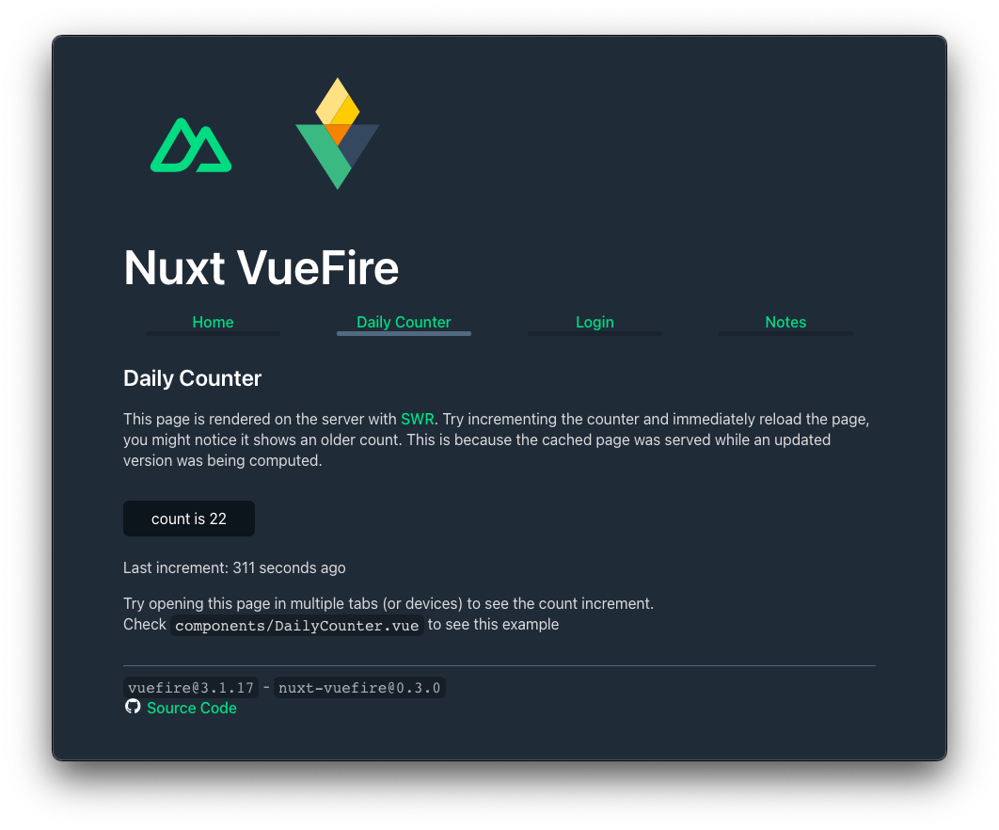

# Nuxt VueFire Demo

This is a Firebase Demo with Nuxt. It uses [VueFire](https://vuefire.vuejs.org/) to connect to Firebase and [Nuxt](https://nuxtjs.org/) to create a server side rendered app.

It's a simplified version of [the demos shown in docs](https://vuefire.vuejs.org/nuxt/deployment.html). You can check the [deployed online](https://nuxtotravez.web.app).

